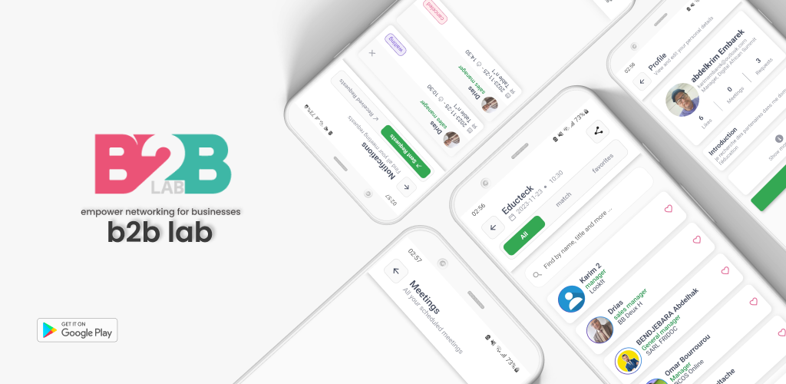
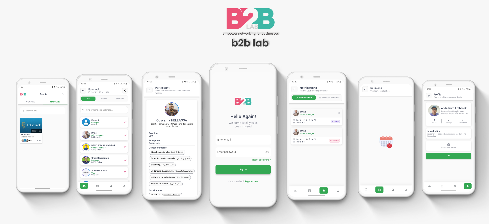

# b2b lab (ANDROID & IOS):

flutter app that i developed using flutter(frontend and api integration + firebase) .

B2B lab application designed to streamline participant interactions and enhance networking opportunities. Developed to facilitate seamless event experiences, the app enables users to:

- Enter essential information such as name, job title, company, and contact details.
- join events by entering informations  (center of interest, activity area, participation type, availability)
- View a comprehensive list of event participants, allowing for easy networking and collaboration.
- Utilize a matching algorithm to connect with participants based on shared interests and objectives.
- Send, accept, cancel, and reschedule meeting requests with fellow attendees.
- Enhance networking capabilities and foster meaningful connections within the B2B community.

Built with user experience and networking efficiency in mind, this app aims to revolutionize B2B event participation and engagement.

# Used Packages

This project utilizes the following Flutter packages:

- image_stack
- calendar_date_picker2
- http
- cached_network_image
- readmore
- image_picker
- flutter_slidable
- dio
- firebase_auth
- firebase_core
- firebase_database
- firebase_messaging
- elegant_notification
- font_awesome_flutter
- countup
- shared_preferences
- get
- connectivity_plus
- internet_connection_checker_plus
- share_plus
- popover
- qr_flutter
- flutter_launcher_icons
- flutter_native_splash

# screenshots :

